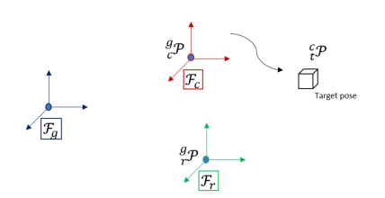
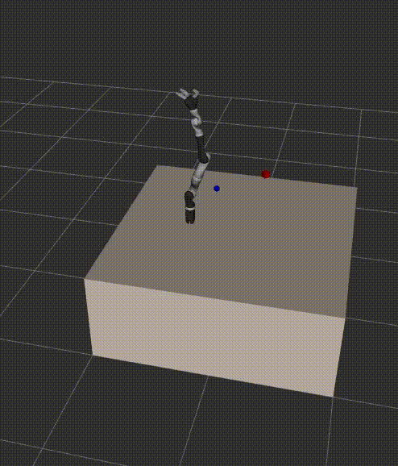
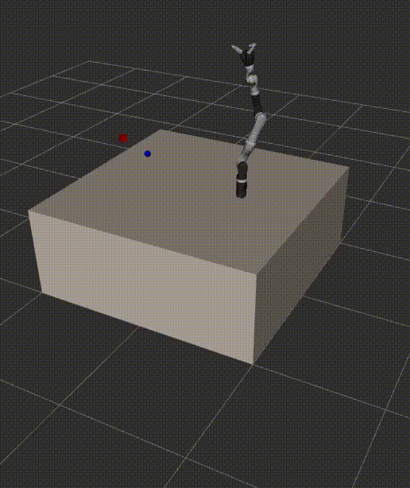
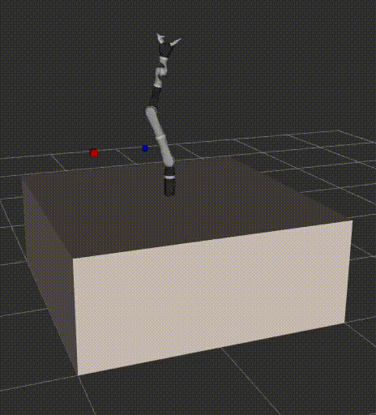
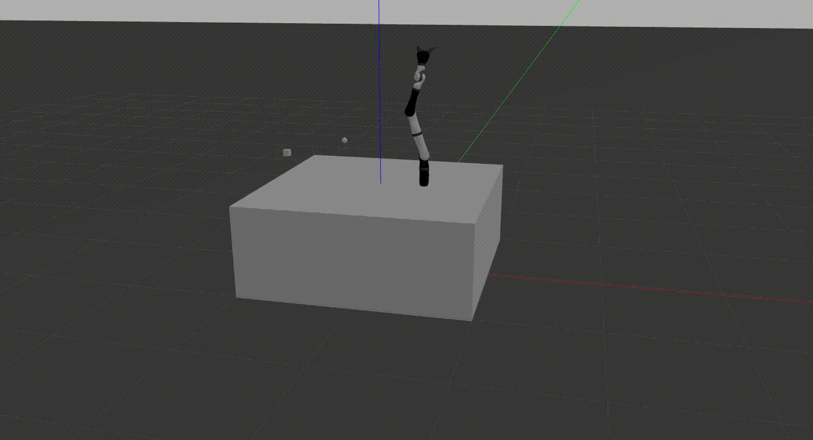

# sayens
Optic table environment description with a Kinova Jaco 7DoF robotic arm and a camera
The objects in the environments have variable positions and can be entered when launching the project.

# Table of Contents
- [sayens](#sayens)
- [Created by](#created-by)
- [Installation](#installation)
- [Running](#running)
- [Scope](#scope)
- [Results](#results)

## Created by:

**Amine Dhemaied** 

## Installation:
First clone the repository **kinova-ros** from this [link](https://github.com/Kinovarobotics/kinova-ros).

**Don't fonget to install all the necessary packages like:**

Run ```sudo apt-get install ros-noetic-moveit*```
and ```sudo apt-get install ros*controller*```
Then do build your catkin workspace.

Then clone this repository and build the catkin_ws 


## Running:
to run the project ```roslaunch sayens world.launch``` 

or with choosing the parameters:
```
roslaunch sayens world.launch \
robot_to_table_x:=0.0 \
robot_to_table_y:=0.0 \
robot_to_table_z:=0.405 \
robot_to_table_roll:=0 \
robot_to_table_pitch:=0 \
robot_to_table_yaw:=1.57 \
camera_to_table_x:=0.6 \
camera_to_table_y:=0.0 \
camera_to_table_z:=0.8 \
camera_to_table_roll:=0 \
camera_to_table_pitch:=0 \
camera_to_table_yaw:=1.57 \
target_to_camera_x:=0.0 \
target_to_camera_y:=0.4 \
target_to_camera_z:=0.0 \
target_to_camera_roll:=0 \
target_to_camera_pitch:=0 \
target_to_camera_yaw:=0
```

and then run client  ```rosrun sayens client.sh```

## Scope

The launch file creates a ros service that computes the target position with respect to the robot based on a set of transformations defined in a urdf (xacro file) and also defined as rosparam to be entered by the user as arguments.  

<p align="center">
    
    <p style="text-align:center;">The figure shows how the relationship between objects in our setup are set. The Target Pose is defined with respect to the Camera frame, and the camera is defined with respect to the world frame. And the robot is also defined with respect to the world frame.</p>
</p>

Once the pose is computed, the service remains idle, waiting for clients to connect. When a client node initiates a request, it retrieves the computed pose. Subsequently, the client node utilizes this pose to move the robot by employing the resolved rate motion control algorithm.

## Results:

<table>
  <tr>
    <td>
      
      <p style="text-align:center;">example1 (Rviz)</p>
    </td>
    <td>
      
      <p style="text-align:center;">example2 (Rviz)</p>
    </td>
    <td>
      
      <p style="text-align:center;">example3 (Rviz)</p>
    </td>
  </tr>
</table>
The red object is the camera and the blue object is the target point.


Below you can see the results in Gazebo simulation.


<p align="center">
    
    <p style="text-align:center;">example4 (Gazebo)</p>
</p>